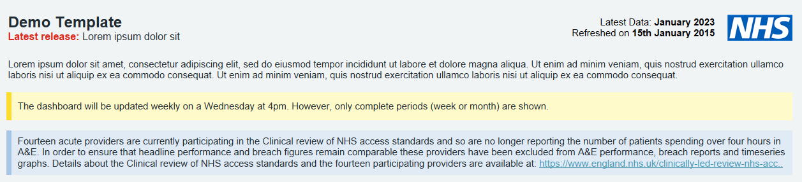

# NHS logo

The NHS logo should always be used in the NHS blue colour. For dashboards that use the web wrapper or are viewed directly on server the logo is to be located in the top right hand corner of the page.

## Example in practice

!!! tip "Dimensions"

    - Height 40px

    - Width 75px

    - Margin of 32px
 
For further details and a link to the download refer to the <a href="https://www.england.nhs.uk/nhsidentity/identity-guidelines/nhs-logo/">NHS England identity guidelines page.</a>